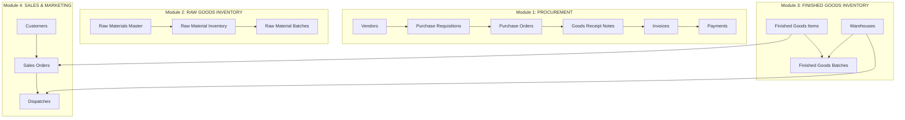
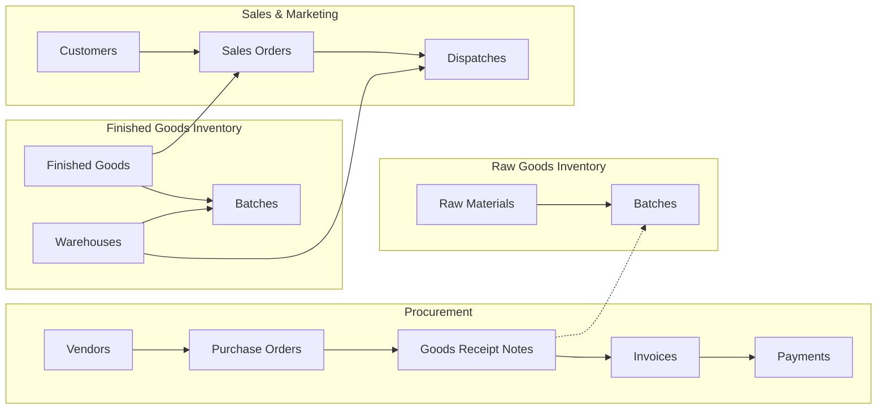

# Software Requirements Specification (SRS)
## PharmaERP Backend System

**Version:** 1.0  
**Date:** January 10, 2026  

---

## Table of Contents

1. [Introduction](#1-introduction)
2. [System Architecture](#2-system-architecture)
3. [Module Structure Overview](#3-module-structure-overview)
4. [Module 1: Procurement](#4-module-1-procurement)
   - [4.1 Vendors](#41-vendors)
   - [4.2 Purchase Requisitions](#42-purchase-requisitions)
   - [4.3 Purchase Orders](#43-purchase-orders)
   - [4.4 Goods Receipt Notes](#44-goods-receipt-notes)
   - [4.5 Invoices](#45-invoices)
   - [4.6 Payments](#46-payments)
5. [Module 2: Raw Goods Inventory](#5-module-2-raw-goods-inventory)
   - [5.1 Raw Materials Master](#51-raw-materials-master)
   - [5.2 Raw Material Inventory](#52-raw-material-inventory)
   - [5.3 Raw Material Batches](#53-raw-material-batches)
6. [Module 3: Finished Goods Inventory](#6-module-3-finished-goods-inventory)
   - [6.1 Finished Goods Items](#61-finished-goods-items)
   - [6.2 Finished Goods Batches](#62-finished-goods-batches)
   - [6.3 Warehouses](#63-warehouses)
7. [Module 4: Sales & Marketing](#7-module-4-sales--marketing)
   - [7.1 Customers](#71-customers)
   - [7.2 Sales Orders](#72-sales-orders)
   - [7.3 Dispatches](#73-dispatches)
8. [Module Interconnections](#8-module-interconnections)
9. [Global Features](#9-global-features)

---

## 1. Introduction

### 1.1 Purpose
This document provides a comprehensive specification of the PharmaERP Backend System, a pharmaceutical Enterprise Resource Planning system designed to manage the complete supply chain from vendors to customers.

### 1.2 Technology Stack
| Component | Technology |
|-----------|------------|
| Framework | NestJS (Node.js) |
| ORM | Drizzle ORM |
| Database | PostgreSQL (NeonDB) |
| Language | TypeScript |

### 1.3 Scope
The system is organized into **4 major modules**:
1. **Procurement** - Vendor management and purchasing cycle
2. **Raw Goods Inventory** - Raw material tracking and batch management
3. **Finished Goods Inventory** - Product and warehouse management
4. **Sales & Marketing** - Customer orders and dispatch

---

## 2. System Architecture

```
┌─────────────────────────────────────────────────────────────────────────────┐
│                              API Layer (NestJS)                              │
├─────────────────────────────────────────────────────────────────────────────┤
│  Controllers → Services → Database (Drizzle ORM) → PostgreSQL (NeonDB)     │
└─────────────────────────────────────────────────────────────────────────────┘
```

### Module File Structure
```
module/
├── module.module.ts        # NestJS Module definition
├── module.controller.ts    # REST API endpoints
├── module.service.ts       # Business logic
├── dto/
│   ├── create-*.dto.ts     # Data Transfer Objects for creation
│   └── update-*.dto.ts     # Data Transfer Objects for updates
└── entities/
    └── *.entity.ts         # Entity definitions
```

---

## 3. Module Structure Overview



---

## 4. Module 1: PROCUREMENT

> **Purpose:** Manages the complete procurement cycle from vendor registration through payment processing. Covers the Procure-to-Pay (P2P) workflow.

### Module Flow
```
Vendors → Purchase Requisitions → Purchase Orders → Goods Receipt Notes → Invoices → Payments
```

---

### 4.1 Vendors

#### Purpose
Manages supplier/vendor information including basic details, compliance status (GMP certification, audit status), and financial terms.

#### Database Table: `vendors`

| Field | Type | Description | Constraints |
|-------|------|-------------|-------------|
| `id` | UUID | Primary key | Auto-generated |
| **Basic Info** |
| `legal_name` | TEXT | Official business name | NOT NULL |
| `vendor_type` | ENUM | Category | `Raw Material`, `Packaging`, `Services`, `Equipment` |
| `business_category` | TEXT | Classification | Optional |
| `registration_number` | TEXT | Company registration | Optional |
| `ntn_vat_gst` | TEXT | Tax ID | Optional |
| `country` | TEXT | Country | Optional |
| `city` | TEXT | City | Optional |
| `address` | TEXT | Full address | Optional |
| `status` | ENUM | Status | `Active` (default), `Inactive`, `Blacklisted` |
| `contact_person` | TEXT | Primary contact | Optional |
| `contact_number` | TEXT | Phone | Optional |
| `email` | TEXT | Email | Optional |
| `website` | TEXT | Website | Optional |
| **Compliance** |
| `is_gmp_certified` | BOOLEAN | GMP status | Default: `false` |
| `is_blacklisted` | BOOLEAN | Blacklist flag | Default: `false` |
| `regulatory_license` | TEXT | License number | Optional |
| `license_expiry_date` | DATE | Expiry | Optional |
| `quality_rating` | INTEGER | Rating 1-5 | Optional |
| `audit_status` | ENUM | Audit status | `Pending`, `Cleared`, `Failed` |
| `risk_category` | ENUM | Risk level | `Low`, `Medium`, `High` |
| **Financial** |
| `bank_name` | TEXT | Bank name | Optional |
| `account_title` | TEXT | Account holder | Optional |
| `account_number` | TEXT | Account number | Optional |
| `currency` | TEXT | Currency | Default: `PKR` |
| `payment_terms` | ENUM | Terms | `Net-30`, `Net-60`, `Advanced` |
| `credit_limit` | NUMERIC | Credit limit | Optional |
| `tax_withholding_percent` | NUMERIC | Tax rate | Optional |
| **Timestamps** |
| `created_at` | TIMESTAMP | Created | Auto-generated |
| `updated_at` | TIMESTAMP | Updated | Auto-updated |

#### CRUD Operations

| Operation | Endpoint | Method | Description |
|-----------|----------|--------|-------------|
| Create | `/vendors` | POST | Creates vendor with all info |
| Read All | `/vendors` | GET | Returns all vendors |
| Read One | `/vendors/:id` | GET | Returns vendor by ID |
| Update | `/vendors/:id` | PATCH | Partial update |
| Delete | `/vendors/:id` | DELETE | Soft delete to trash |

#### Business Logic
- **Soft Delete:** Data preserved in `trash` table before removal
- **Type Conversion:** `creditLimit` and `taxWithholdingPercent` converted to strings

---

### 4.2 Purchase Requisitions

#### Purpose
Manages internal purchase requests with line items, cost estimation, and approval workflow.

#### Database Tables

##### Header: `purchase_requisitions`

| Field | Type | Description | Constraints |
|-------|------|-------------|-------------|
| `id` | UUID | Primary key | Auto-generated |
| `req_number` | TEXT | PR number | NOT NULL, UNIQUE |
| `requisition_date` | DATE | Request date | NOT NULL |
| `requested_by` | TEXT | Requester | NOT NULL |
| `department` | TEXT | Department | Optional |
| `cost_center` | TEXT | Cost center | Optional |
| `priority` | ENUM | Urgency | `Normal` (default), `Urgent` |
| `expected_delivery_date` | DATE | Required date | Optional |
| `budget_reference` | TEXT | Budget code | Optional |
| `status` | ENUM | Status | `Draft`, `Pending Approval`, `Approved`, `Rejected`, `Converted` |
| `total_estimated_cost` | NUMERIC | Total cost | Calculated |
| `created_at` | TIMESTAMP | Created | Auto-generated |
| `updated_at` | TIMESTAMP | Updated | Auto-updated |

##### Line Items: `purchase_requisition_items`

| Field | Type | Description | Constraints |
|-------|------|-------------|-------------|
| `id` | UUID | Primary key | Auto-generated |
| `pr_id` | UUID | FK to header | NOT NULL |
| `item_code` | TEXT | Item code | Optional |
| `item_name` | TEXT | Description | NOT NULL |
| `category` | TEXT | Category | Optional |
| `uom` | TEXT | Unit of measure | Optional |
| `quantity` | INTEGER | Quantity | NOT NULL |
| `estimated_unit_cost` | NUMERIC | Unit cost | Optional |
| `total_cost` | NUMERIC | Line total | Calculated |
| `preferred_vendor_id` | UUID | FK to vendors | Optional |
| `specification` | TEXT | Specs | Optional |

#### CRUD Operations

| Operation | Endpoint | Method | Description |
|-----------|----------|--------|-------------|
| Create | `/purchase-requisitions` | POST | Creates PR with items (transaction) |
| Read All | `/purchase-requisitions` | GET | Returns all PRs |
| Read One | `/purchase-requisitions/:id` | GET | Returns PR with items |
| Update | `/purchase-requisitions/:id` | PATCH | Updates header |
| Delete | `/purchase-requisitions/:id` | DELETE | Soft delete with items |

#### Business Logic
- **Transaction:** Header and items inserted atomically
- **Cost Calculation:**
  ```
  total_cost = quantity × estimated_unit_cost (per item)
  total_estimated_cost = Σ total_cost (all items)
  ```
- **Cascade Delete:** Items deleted with header, full data saved to trash

---

### 4.3 Purchase Orders

#### Purpose
Manages vendor purchase orders with detailed line items, pricing, taxes, and financial calculations.

#### Database Tables

##### Header: `purchase_orders`

| Field | Type | Description | Constraints |
|-------|------|-------------|-------------|
| `id` | UUID | Primary key | Auto-generated |
| `po_number` | TEXT | PO number | NOT NULL, UNIQUE |
| `po_date` | DATE | Order date | NOT NULL |
| `vendor_id` | UUID | FK to vendors | NOT NULL |
| `reference_pr_id` | UUID | FK to PRs | Optional |
| `currency` | TEXT | Currency | Default: `PKR` |
| `payment_terms` | TEXT | Terms | Optional |
| `incoterms` | TEXT | Shipping terms | Optional |
| `delivery_schedule` | DATE | Delivery date | Optional |
| `delivery_location` | TEXT | Location | Optional |
| `freight_charges` | NUMERIC | Freight | Default: 0 |
| `insurance_charges` | NUMERIC | Insurance | Default: 0 |
| `subtotal` | NUMERIC | Subtotal | Calculated |
| `tax_amount` | NUMERIC | Tax total | Calculated |
| `total_amount` | NUMERIC | Grand total | Calculated |
| `status` | ENUM | Status | `Draft`, `Issued`, `Partial`, `Closed`, `Cancelled` |
| `created_at` | TIMESTAMP | Created | Auto-generated |
| `updated_at` | TIMESTAMP | Updated | Auto-updated |

##### Line Items: `purchase_order_items`

| Field | Type | Description | Constraints |
|-------|------|-------------|-------------|
| `id` | UUID | Primary key | Auto-generated |
| `po_id` | UUID | FK to header | NOT NULL |
| `item_code` | TEXT | Item code | Optional |
| `description` | TEXT | Description | Optional |
| `quantity` | INTEGER | Quantity | NOT NULL |
| `unit_price` | NUMERIC | Unit price | NOT NULL |
| `discount_percent` | NUMERIC | Discount % | Default: 0 |
| `tax_percent` | NUMERIC | Tax % | Default: 0 |
| `net_amount` | NUMERIC | After discount | Calculated |
| `total_amount` | NUMERIC | With tax | Calculated |
| `is_batch_required` | BOOLEAN | Batch tracking | Default: `false` |

#### CRUD Operations

| Operation | Endpoint | Method | Description |
|-----------|----------|--------|-------------|
| Create | `/purchase-orders` | POST | Creates PO with items (transaction) |
| Read All | `/purchase-orders` | GET | Returns all POs |
| Read One | `/purchase-orders/:id` | GET | Returns PO with items |
| Update | `/purchase-orders/:id` | PATCH | Updates header |
| Delete | `/purchase-orders/:id` | DELETE | Soft delete with items |

#### Business Logic
```
Per Item:
  grossAmount = quantity × unitPrice
  discountAmount = grossAmount × (discountPercent / 100)
  netAmount = grossAmount - discountAmount
  taxAmount = netAmount × (taxPercent / 100)
  totalAmount = netAmount + taxAmount

PO Totals:
  subtotal = Σ netAmount
  taxAmount = Σ itemTaxAmount
  totalAmount = subtotal + taxAmount + freightCharges + insuranceCharges
```

---

### 4.4 Goods Receipt Notes

#### Purpose
Manages receiving of goods against purchase orders with QC verification and inventory posting.

#### Database Tables

##### Header: `goods_receipt_notes`

| Field | Type | Description | Constraints |
|-------|------|-------------|-------------|
| `id` | UUID | Primary key | Auto-generated |
| `grn_number` | TEXT | GRN number | NOT NULL, UNIQUE |
| `grn_date` | DATE | Receipt date | NOT NULL |
| `po_id` | UUID | FK to POs | Optional |
| `warehouse_location` | TEXT | Location | Optional |
| `received_by` | TEXT | Receiver | Optional |
| `qc_required` | BOOLEAN | QC needed | Default: `false` |
| `qc_status` | ENUM | QC result | `Pending`, `Passed`, `Failed`, `Skipped` |
| `qc_remarks` | TEXT | QC notes | Optional |
| `stock_posted` | BOOLEAN | Inventory updated | Default: `false` |
| `inventory_location` | TEXT | Storage location | Optional |
| `status` | ENUM | Status | `Draft`, `Submitted`, `Approved` |
| `created_at` | TIMESTAMP | Created | Auto-generated |
| `updated_at` | TIMESTAMP | Updated | Auto-updated |

##### Line Items: `goods_receipt_items`

| Field | Type | Description | Constraints |
|-------|------|-------------|-------------|
| `id` | UUID | Primary key | Auto-generated |
| `grn_id` | UUID | FK to header | NOT NULL |
| `item_code` | TEXT | Item code | Optional |
| `item_name` | TEXT | Description | Optional |
| `ordered_qty` | INTEGER | PO quantity | NOT NULL |
| `received_qty` | INTEGER | Received | NOT NULL |
| `rejected_qty` | INTEGER | Rejected | Default: 0 |
| `batch_number` | TEXT | Batch ID | Optional |
| `mfg_date` | DATE | Manufacturing date | Optional |
| `expiry_date` | DATE | Expiry | Optional |
| `storage_condition` | TEXT | Storage | Optional |

#### CRUD Operations

| Operation | Endpoint | Method | Description |
|-----------|----------|--------|-------------|
| Create | `/goods-receipt-notes` | POST | Creates GRN with items |
| Read All | `/goods-receipt-notes` | GET | Returns all GRNs |
| Read One | `/goods-receipt-notes/:id` | GET | Returns GRN with items |
| Update | `/goods-receipt-notes/:id` | PATCH | Updates header |
| Delete | `/goods-receipt-notes/:id` | DELETE | Soft delete with items |

#### Business Logic
- **QC Status Logic:**
  - `qcRequired = true` → `qcStatus = Pending`
  - `qcRequired = false` → `qcStatus = Skipped`
- **Quantity Tracking:** ordered vs received vs rejected

---

### 4.5 Invoices

#### Purpose
Manages vendor invoices linked to purchase orders and goods receipts for accounts payable.

#### Database Table: `invoices`

| Field | Type | Description | Constraints |
|-------|------|-------------|-------------|
| `id` | UUID | Primary key | Auto-generated |
| `invoice_number` | TEXT | Vendor invoice # | NOT NULL, UNIQUE |
| `invoice_date` | DATE | Date | NOT NULL |
| `vendor_id` | UUID | FK to vendors | NOT NULL |
| `po_id` | UUID | FK to POs | Optional |
| `grn_id` | UUID | FK to GRNs | Optional |
| `amount` | NUMERIC | Total | NOT NULL |
| `due_date` | DATE | Due date | NOT NULL |
| `status` | ENUM | Status | `Pending`, `Paid`, `Overdue`, `Cancelled` |
| `created_at` | TIMESTAMP | Created | Auto-generated |
| `updated_at` | TIMESTAMP | Updated | Auto-updated |

#### CRUD Operations

| Operation | Endpoint | Method | Description |
|-----------|----------|--------|-------------|
| Create | `/invoices` | POST | Creates invoice |
| Read All | `/invoices` | GET | Returns all invoices |
| Get Stats | `/invoices/stats` | GET | Returns statistics |
| Read One | `/invoices/:id` | GET | Returns invoice |
| Update | `/invoices/:id` | PATCH | Updates invoice |
| Delete | `/invoices/:id` | DELETE | Soft delete |

#### Business Logic
- **Three-Way Match:** Links to PO and GRN for verification
- **Statistics:** Provides total/pending counts and sums

---

### 4.6 Payments

#### Purpose
Records payments against invoices with multiple payment methods and tax deductions.

#### Database Table: `payments`

| Field | Type | Description | Constraints |
|-------|------|-------------|-------------|
| `id` | UUID | Primary key | Auto-generated |
| `invoice_id` | UUID | FK to invoices | NOT NULL |
| `payment_date` | DATE | Date | NOT NULL |
| `payment_method` | ENUM | Method | `Bank Transfer`, `Cheque`, `Cash`, `Credit Card` |
| `amount_paid` | NUMERIC | Amount | NOT NULL |
| `tax_withheld` | NUMERIC | Tax withheld | Default: 0 |
| `advance_adjustments` | NUMERIC | Advance offset | Default: 0 |
| `payment_reference` | TEXT | Reference | Optional |
| `status` | ENUM | Status | `Pending`, `Completed`, `Failed` |
| `created_at` | TIMESTAMP | Created | Auto-generated |
| `updated_at` | TIMESTAMP | Updated | Auto-updated |

#### CRUD Operations

| Operation | Endpoint | Method | Description |
|-----------|----------|--------|-------------|
| Create | `/payments` | POST | Creates payment |
| Read All | `/payments` | GET | Returns all payments |
| Read One | `/payments/:id` | GET | Returns payment |
| Update | `/payments/:id` | PATCH | Updates payment |
| Delete | `/payments/:id` | DELETE | Soft delete |

---

## 5. Module 2: RAW GOODS INVENTORY

> **Purpose:** Manages pharmaceutical raw materials (APIs, excipients, packaging) with inventory settings and batch-level tracking including QC status.

### Module Flow
```
Raw Materials Master → Raw Material Inventory → Raw Material Batches
```

---

### 5.1 Raw Materials Master

#### Purpose
Master data for all raw materials with basic identification and classification.

#### Database Table: `raw_materials`

| Field | Type | Description | Constraints |
|-------|------|-------------|-------------|
| `id` | UUID | Primary key | Auto-generated |
| `name` | TEXT | Material name | NOT NULL, UNIQUE |
| `code` | TEXT | Internal code | NOT NULL, UNIQUE |
| `description` | TEXT | Description | Optional |
| `type` | ENUM | Material type | `API`, `Excipient`, `Packaging` |
| `unit_of_measure` | TEXT | UOM (kg, L, pcs) | NOT NULL |
| `created_at` | TIMESTAMP | Created | Auto-generated |
| `updated_at` | TIMESTAMP | Updated | Auto-updated |

#### CRUD Operations

| Operation | Endpoint | Method | Description |
|-----------|----------|--------|-------------|
| Create | `/raw-materials` | POST | Creates material |
| Read All | `/raw-materials` | GET | Returns all materials |
| Read One | `/raw-materials/:id` | GET | Returns material |
| Delete | `/raw-materials/:id` | DELETE | Soft delete |

---

### 5.2 Raw Material Inventory

#### Purpose
Inventory configuration including storage conditions, reorder levels, and safety stock.

#### Database Table: `raw_material_inventory`

| Field | Type | Description | Constraints |
|-------|------|-------------|-------------|
| `id` | UUID | Primary key | Auto-generated |
| `material_id` | UUID | FK to raw_materials | NOT NULL |
| `storage_condition` | TEXT | Storage requirements | Optional |
| `reorder_level` | INTEGER | Min quantity trigger | Default: 0 |
| `safety_stock` | INTEGER | Safety buffer | Default: 0 |
| `status` | ENUM | Status | `Active`, `Inactive` |
| `created_at` | TIMESTAMP | Created | Auto-generated |
| `updated_at` | TIMESTAMP | Updated | Auto-updated |

#### CRUD Operations

| Operation | Endpoint | Method | Description |
|-----------|----------|--------|-------------|
| Create | `/raw-materials/inventory` | POST | Creates inventory config |

---

### 5.3 Raw Material Batches

#### Purpose
Batch-level tracking with quantity, expiry, and QC status management.

#### Database Table: `raw_material_batches`

| Field | Type | Description | Constraints |
|-------|------|-------------|-------------|
| `id` | UUID | Primary key | Auto-generated |
| `inventory_id` | UUID | FK to inventory | NOT NULL |
| `batch_number` | TEXT | Batch ID | NOT NULL |
| `quantity_available` | INTEGER | Current quantity | NOT NULL |
| `expiry_date` | DATE | Expiration | Optional |
| `qc_status` | ENUM | QC status | `Quarantine` (default), `Approved`, `Rejected` |
| `warehouse_location` | TEXT | Location | Optional |
| `created_at` | TIMESTAMP | Created | Auto-generated |
| `updated_at` | TIMESTAMP | Updated | Auto-updated |

#### CRUD Operations

| Operation | Endpoint | Method | Description |
|-----------|----------|--------|-------------|
| Add Batch | `/raw-materials/batches` | POST | Adds batch |
| Get Batches | `/raw-materials/batches/:inventoryId` | GET | Gets batches |

#### Business Logic
- **QC Quarantine:** New batches default to `Quarantine` until approved
- **Hierarchy:** Material → Inventory → Batches

---

## 6. Module 3: FINISHED GOODS INVENTORY

> **Purpose:** Manages manufactured pharmaceutical products with production batch tracking and warehouse storage.

### Module Flow
```
Finished Goods Items → Finished Goods Batches ← Warehouses
```

---

### 6.1 Finished Goods Items

#### Purpose
Product master data with dosage form, strength, and pricing.

#### Database Table: `finished_goods_items`

| Field | Type | Description | Constraints |
|-------|------|-------------|-------------|
| `id` | UUID | Primary key | Auto-generated |
| `item_code` | TEXT | Product SKU | NOT NULL, UNIQUE |
| `item_name` | TEXT | Product name | NOT NULL |
| `dosage_form` | TEXT | Form (Tablet, Syrup) | Optional |
| `strength` | TEXT | Strength (500mg) | Optional |
| `pack_size` | TEXT | Package size | Optional |
| `shelf_life` | INTEGER | Months | Optional |
| `mrp` | NUMERIC | Max retail price | Default: 0 |
| `status` | ENUM | Status | `Active`, `Inactive` |
| `created_at` | TIMESTAMP | Created | Auto-generated |
| `updated_at` | TIMESTAMP | Updated | Auto-updated |

#### CRUD Operations

| Operation | Endpoint | Method | Description |
|-----------|----------|--------|-------------|
| Create | `/finished-goods` | POST | Creates product |
| Read All | `/finished-goods` | GET | Returns all products |
| Read One | `/finished-goods/:id` | GET | Returns product |
| Delete | `/finished-goods/:id` | DELETE | Soft delete |

---

### 6.2 Finished Goods Batches

#### Purpose
Production batch tracking with manufacturing dates, quantities, and QC release status.

#### Database Table: `finished_goods_batches`

| Field | Type | Description | Constraints |
|-------|------|-------------|-------------|
| `id` | UUID | Primary key | Auto-generated |
| `item_id` | UUID | FK to items | NOT NULL |
| `batch_number` | TEXT | Production batch | NOT NULL |
| `mfg_date` | DATE | Manufacturing date | NOT NULL |
| `expiry_date` | DATE | Expiry | NOT NULL |
| `quantity_produced` | INTEGER | Total produced | NOT NULL |
| `quantity_available` | INTEGER | Current stock | NOT NULL |
| `qc_status` | ENUM | QC release | `Hold` (default), `Released`, `Rejected` |
| `warehouse_id` | UUID | FK to warehouses | Optional |
| `created_at` | TIMESTAMP | Created | Auto-generated |
| `updated_at` | TIMESTAMP | Updated | Auto-updated |

#### CRUD Operations

| Operation | Endpoint | Method | Description |
|-----------|----------|--------|-------------|
| Add Batch | `/finished-goods/batches` | POST | Adds batch |
| Get Batches | `/finished-goods/:itemId/batches` | GET | Gets batches |

#### Business Logic
- **Initial Quantity:** `quantityAvailable = quantityProduced` on creation
- **QC Hold:** New batches default to `Hold` pending release

---

### 6.3 Warehouses

#### Purpose
Storage facility management with environmental monitoring for cold chain requirements.

#### Database Tables

##### Main: `warehouses`

| Field | Type | Description | Constraints |
|-------|------|-------------|-------------|
| `id` | UUID | Primary key | Auto-generated |
| `name` | TEXT | Warehouse name | NOT NULL, UNIQUE |
| `type` | ENUM | Type | `Normal`, `Cold Chain` |
| `location` | TEXT | Address | Optional |
| `temperature_range` | TEXT | Temp requirements | Optional |
| `humidity_range` | TEXT | Humidity requirements | Optional |
| `status` | ENUM | Status | `Active`, `Inactive` |
| `created_at` | TIMESTAMP | Created | Auto-generated |
| `updated_at` | TIMESTAMP | Updated | Auto-updated |

##### Monitoring: `cold_chain_logs`

| Field | Type | Description | Constraints |
|-------|------|-------------|-------------|
| `id` | UUID | Primary key | Auto-generated |
| `warehouse_id` | UUID | FK to warehouses | NOT NULL |
| `temperature` | NUMERIC | Temperature | Optional |
| `humidity` | NUMERIC | Humidity | Optional |
| `recorded_at` | TIMESTAMP | Reading time | Auto-generated |
| `alert_triggered` | BOOLEAN | Alert flag | Default: `false` |

#### CRUD Operations

| Operation | Endpoint | Method | Description |
|-----------|----------|--------|-------------|
| Create | `/warehouses` | POST | Creates warehouse |
| Read All | `/warehouses` | GET | Returns all warehouses |
| Read One | `/warehouses/:id` | GET | Returns warehouse |
| Delete | `/warehouses/:id` | DELETE | Soft delete |

---

## 7. Module 4: SALES & MARKETING

> **Purpose:** Manages customer relationships, sales orders, and delivery/dispatch operations.

### Module Flow
```
Customers → Sales Orders → Dispatches ← Warehouses
                ↑
        Finished Goods Items
```

---

### 7.1 Customers

#### Purpose
Customer master data for distributors, hospitals, and pharmacies.

#### Database Table: `customers`

| Field | Type | Description | Constraints |
|-------|------|-------------|-------------|
| `id` | UUID | Primary key | Auto-generated |
| `name` | TEXT | Customer name | NOT NULL |
| `type` | ENUM | Category | `Distributor`, `Hospital`, `Pharmacy` |
| `contact_person` | TEXT | Contact | Optional |
| `phone` | TEXT | Phone | Optional |
| `email` | TEXT | Email | Optional |
| `billing_address` | TEXT | Invoice address | Optional |
| `shipping_address` | TEXT | Delivery address | Optional |
| `tax_id` | TEXT | Tax ID | Optional |
| `status` | TEXT | Status | Default: `Active` |
| `created_at` | TIMESTAMP | Created | Auto-generated |
| `updated_at` | TIMESTAMP | Updated | Auto-updated |

#### CRUD Operations

| Operation | Endpoint | Method | Description |
|-----------|----------|--------|-------------|
| Create | `/customers` | POST | Creates customer |
| Read All | `/customers` | GET | Returns all customers |
| Read One | `/customers/:id` | GET | Returns customer |
| Delete | `/customers/:id` | DELETE | Soft delete |

---

### 7.2 Sales Orders

#### Purpose
Customer order management with line items and automatic total calculation.

#### Database Tables

##### Header: `sales_orders`

| Field | Type | Description | Constraints |
|-------|------|-------------|-------------|
| `id` | UUID | Primary key | Auto-generated |
| `customer_id` | UUID | FK to customers | NOT NULL |
| `order_date` | DATE | Order date | NOT NULL |
| `delivery_date` | DATE | Expected delivery | Optional |
| `status` | ENUM | Status | `Draft`, `Confirmed`, `Dispatched`, `Cancelled` |
| `total_amount` | NUMERIC | Order total | Calculated |
| `created_by` | TEXT | Creator | Optional |
| `created_at` | TIMESTAMP | Created | Auto-generated |
| `updated_at` | TIMESTAMP | Updated | Auto-updated |

##### Line Items: `sales_order_items`

| Field | Type | Description | Constraints |
|-------|------|-------------|-------------|
| `id` | UUID | Primary key | Auto-generated |
| `sales_order_id` | UUID | FK to header | NOT NULL |
| `item_id` | UUID | FK to finished_goods | NOT NULL |
| `batch_number` | TEXT | Batch sold | Optional |
| `quantity` | INTEGER | Quantity | NOT NULL |
| `unit_price` | NUMERIC | Price | NOT NULL |
| `discount` | NUMERIC | Discount amount | Default: 0 |
| `tax` | NUMERIC | Tax amount | Default: 0 |
| `net_amount` | NUMERIC | Line total | NOT NULL |

#### CRUD Operations

| Operation | Endpoint | Method | Description |
|-----------|----------|--------|-------------|
| Create | `/sales` | POST | Creates order with items |
| Read All | `/sales` | GET | Returns all orders |
| Read One | `/sales/:id` | GET | Returns order |
| Delete | `/sales/:id` | DELETE | Soft delete with items |

#### Business Logic
```
Per Item:
  grossAmount = quantity × unitPrice
  netAmount = grossAmount - discount + tax

Order Total:
  totalAmount = Σ netAmount
```

---

### 7.3 Dispatches

#### Purpose
Shipment tracking from warehouse to customer with delivery status.

#### Database Table: `dispatches`

| Field | Type | Description | Constraints |
|-------|------|-------------|-------------|
| `id` | UUID | Primary key | Auto-generated |
| `sales_order_id` | UUID | FK to orders | NOT NULL |
| `warehouse_id` | UUID | FK to warehouses | Optional |
| `dispatch_date` | DATE | Ship date | Auto-generated |
| `transporter` | TEXT | Carrier | Optional |
| `delivery_status` | ENUM | Status | `Pending`, `In-Transit`, `Delivered` |
| `created_at` | TIMESTAMP | Created | Auto-generated |

#### CRUD Operations

| Operation | Endpoint | Method | Description |
|-----------|----------|--------|-------------|
| Create | `/sales/:id/dispatch` | POST | Creates dispatch |

#### Business Logic
- **Auto Status Update:** Creating dispatch sets order status to `Dispatched`

---

## 8. Module Interconnections

### Cross-Module Relationships



### Foreign Key Summary

| From (Table) | Field | To (Table) | Module Connection |
|--------------|-------|------------|-------------------|
| `purchase_orders` | `vendor_id` | `vendors` | Procurement internal |
| `purchase_orders` | `reference_pr_id` | `purchase_requisitions` | Procurement internal |
| `goods_receipt_notes` | `po_id` | `purchase_orders` | Procurement internal |
| `invoices` | `vendor_id` | `vendors` | Procurement internal |
| `invoices` | `po_id` | `purchase_orders` | Procurement internal |
| `invoices` | `grn_id` | `goods_receipt_notes` | Procurement internal |
| `payments` | `invoice_id` | `invoices` | Procurement internal |
| `raw_material_inventory` | `material_id` | `raw_materials` | Raw Goods internal |
| `raw_material_batches` | `inventory_id` | `raw_material_inventory` | Raw Goods internal |
| `finished_goods_batches` | `item_id` | `finished_goods_items` | Finished Goods internal |
| `finished_goods_batches` | `warehouse_id` | `warehouses` | Finished Goods internal |
| `sales_orders` | `customer_id` | `customers` | Sales internal |
| `sales_order_items` | `sales_order_id` | `sales_orders` | Sales internal |
| `sales_order_items` | `item_id` | `finished_goods_items` | **Sales → Finished Goods** |
| `dispatches` | `sales_order_id` | `sales_orders` | Sales internal |
| `dispatches` | `warehouse_id` | `warehouses` | **Sales → Finished Goods** |

---

## 9. Global Features

### 9.1 Soft Delete Pattern

All modules implement soft delete using `trash` table:

```sql
CREATE TABLE trash (
    id UUID PRIMARY KEY,
    original_table TEXT NOT NULL,
    original_id UUID NOT NULL,
    data JSONB NOT NULL,
    deleted_at TIMESTAMP DEFAULT NOW()
);
```

### 9.2 Enum Summary

| Category | Enum | Values |
|----------|------|--------|
| **Procurement** | `vendor_type` | Raw Material, Packaging, Services, Equipment |
| | `vendor_status` | Active, Inactive, Blacklisted |
| | `pr_status` | Draft, Pending Approval, Approved, Rejected, Converted |
| | `po_status` | Draft, Issued, Partial, Closed, Cancelled |
| | `grn_status` | Draft, Submitted, Approved |
| | `invoice_status` | Pending, Paid, Overdue, Cancelled |
| | `payment_status` | Pending, Completed, Failed |
| **Raw Goods** | `raw_material_type` | API, Excipient, Packaging |
| | `batch_status` | Quarantine, Approved, Rejected |
| **Finished Goods** | `fg_status` | Active, Inactive |
| | `qc_release_status` | Released, Hold, Rejected |
| | `warehouse_type` | Normal, Cold Chain |
| **Sales** | `customer_type` | Distributor, Hospital, Pharmacy |
| | `order_status` | Draft, Confirmed, Dispatched, Cancelled |
| | `delivery_status` | Pending, In-Transit, Delivered |

### 9.3 Transaction Support

Header-item tables use database transactions:
- Purchase Requisitions + Items
- Purchase Orders + Items
- Goods Receipt Notes + Items
- Sales Orders + Items

---

*End of Document*
